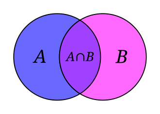
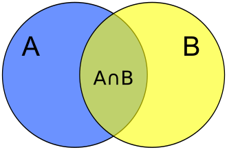
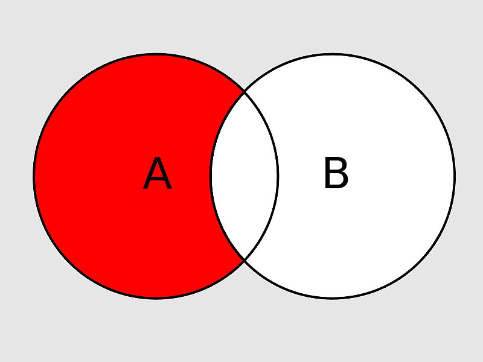

# 📘 Bloco 1 — Álgebra Relacional + Linguagem SQL (DDL e DCL)

> **Duração estimada:** 50 minutos  
> **Formato:** Exposição teórica + prática guiada

---

## 🎯 O que você vai aprender neste bloco

- Compreender o conceito de Álgebra Relacional e suas operações
- Situar a SQL dentro do contexto da Álgebra Relacional
- Conhecer os subconjuntos da SQL: DDL, DML, DCL e DTL
- Revisar os comandos DDL já praticados (CREATE, DROP, ALTER TABLE)
- Compreender o tratamento de constraints ao apagar tabelas
- Praticar os comandos DCL para gerenciamento de usuários e permissões

---

## 💡 Álgebra Relacional

A **Álgebra Relacional (AR)** é um conjunto de operações matemáticas usadas para manipular relações (tabelas) em um banco de dados relacional. Toda operação da AR recebe uma ou mais relações como entrada e produz uma nova relação como resultado — ou seja, o resultado de uma consulta é sempre apresentado na forma de uma tabela.

Na prática, os programadores não utilizam a AR diretamente. Ela serve como **fundamentação teórica** para a linguagem SQL. Compreender a AR ajuda a entender a lógica por trás dos comandos SQL, especialmente o `SELECT`.

### Operações da Álgebra Relacional

As operações são divididas em dois grupos:

**Operações Específicas:**

- **Seleção (σ):** Filtra linhas de uma relação com base em uma condição. Equivale à cláusula `WHERE` do SQL.
- **Projeção (π):** Seleciona colunas específicas de uma relação. Equivale a listar colunas no `SELECT`.
- **Junção (⋈):** Combina tuplas de duas relações com base em uma condição de correspondência. Equivale ao `JOIN` do SQL.

**Operações de Conjuntos:**

- **União (∪):** Combina todas as tuplas de duas relações, eliminando duplicatas. Equivale ao `UNION`.
- **Interseção (∩):** Retorna apenas as tuplas presentes em ambas as relações. Equivale ao `INTERSECT`.
- **Diferença (−):** Retorna as tuplas da primeira relação que não estão na segunda. Equivale ao `EXCEPT`.
- **Produto Cartesiano (×):** Combina cada tupla de uma relação com todas as tuplas de outra. Equivale ao `CROSS JOIN`.

### Exemplos Práticos — Da Álgebra Relacional ao SQL

Para ilustrar cada operação, considere as seguintes tabelas de exemplo:

**PRODUTOS**

| ID | NOME       | PREÇO | ESTOQUE |
| -- | ---------- | ----- | ------- |
| 1  | Notebook   | 2500  | 10      |
| 2  | Smartphone | 1200  | 20      |
| 3  | Tablet     | 800   | 15      |
| 4  | Monitor    | 500   | 30      |
| 5  | Impressora | 300   | 25      |

**VENDAS**

| ID | ID_PRODUTO | DATA  | QUANTIDADE | VALOR_TOTAL |
| -- | ---------- | ----- | ---------- | ----------- |
| 1  | 1          | 09/03 | 2          | 5000        |
| 2  | 2          | 10/03 | 3          | 3600        |
| 3  | 4          | 10/03 | 1          | 500         |
| 4  | 3          | 11/03 | 2          | 1600        |

---

#### 1️⃣ Seleção (σ) — Filtrar linhas

**Álgebra Relacional:**

```
σ PREÇO > 1000 (PRODUTOS)
```

**Ideia:** Produtos que custam mais de 1000.

**Resultado:**

| ID | NOME       | PREÇO | ESTOQUE |
| -- | ---------- | ----- | ------- |
| 1  | Notebook   | 2500  | 10      |
| 2  | Smartphone | 1200  | 20      |

**SQL equivalente:**

```sql
SELECT * FROM produtos
WHERE preco > 1000;
```

---

#### 2️⃣ Projeção (π) — Selecionar colunas

**Álgebra Relacional:**

```
π NOME, PREÇO (PRODUTOS)
```

**Ideia:** Mostrar apenas nome e preço.

**Resultado:**

| NOME       | PREÇO |
| ---------- | ----- |
| Notebook   | 2500  |
| Smartphone | 1200  |
| Tablet     | 800   |
| Monitor    | 500   |
| Impressora | 300   |

**SQL equivalente:**

```sql
SELECT nome, preco FROM produtos;
```

---

#### 3️⃣ Junção (⋈) — Combinar tabelas

**Álgebra Relacional:**

```
PRODUTOS ⋈ PRODUTOS.ID = VENDAS.ID_PRODUTO VENDAS
```

**Ideia:** Mostrar qual produto foi vendido.

**Resultado:**

| NOME       | DATA  | QUANTIDADE |
| ---------- | ----- | ---------- |
| Notebook   | 09/03 | 2          |
| Smartphone | 10/03 | 3          |
| Monitor    | 10/03 | 1          |
| Tablet     | 11/03 | 2          |

**SQL equivalente:**

```sql
SELECT p.nome, v.data, v.quantidade
FROM produtos p
JOIN vendas v
ON p.id = v.id_produto;
```

---

#### 4️⃣ União (∪) — Juntar resultados

> Representação visual com diagrama de Venn da União.
> Fonte: [Wikimedia](https://upload.wikimedia.org/wikipedia/commons/thumb/6/6d/Venn_A_intersect_B.svg/1280px-Venn_A_intersect_B.svg.png).



Imagine duas tabelas:

**PROMOÇÃO**

| NOME     |
| -------- |
| Notebook |
| Tablet   |

**MAIS_VENDIDOS**

| NOME    |
| ------- |
| Tablet  |
| Monitor |

**Álgebra Relacional:**

```
PROMOÇÃO ∪ MAIS_VENDIDOS
```

**Resultado:**

| NOME     |
| -------- |
| Notebook |
| Tablet   |
| Monitor  |

**SQL equivalente:**

```sql
SELECT nome FROM promocao
UNION
SELECT nome FROM mais_vendidos;
```

---

#### 5️⃣ Interseção (∩) — Elementos em comum

> Representação visual com diagrama de Venn da Intersecção.
> Fonte: [Wikimedia](https://en.wikipedia.org/wiki/File:Venn_A_intersect_B_alt.svg).



**Álgebra Relacional:**

```
PROMOÇÃO ∩ MAIS_VENDIDOS
```

**Resultado:**

| NOME   |
| ------ |
| Tablet |

**SQL equivalente:**

```sql
SELECT nome FROM promocao
INTERSECT
SELECT nome FROM mais_vendidos;
```

---

#### 6️⃣ Diferença (−) — Elementos exclusivos

> Representação visual com diagrama de Venn da Diferença.
> Fonte: [Pikist](https://share.google/a3CiIotUCJ0bCBNdj).



**Álgebra Relacional:**

```
PROMOÇÃO − MAIS_VENDIDOS
```

**Resultado:**

| NOME     |
| -------- |
| Notebook |

**SQL equivalente:**

```sql
SELECT nome FROM promocao
EXCEPT
SELECT nome FROM mais_vendidos;
```

---

#### 7️⃣ Produto Cartesiano (×) — Todas as combinações

**Tabelas:**

**CAMISETAS**

| MARCA  |
| ------ |
| Nike   |
| Adidas |

**CORES**

| COR   |
| ----- |
| Azul  |
| Preto |

**Álgebra Relacional:**

```
CAMISETAS × CORES
```

**Resultado:**

| MARCA  | COR   |
| ------ | ----- |
| Nike   | Azul  |
| Nike   | Preto |
| Adidas | Azul  |
| Adidas | Preto |

**SQL equivalente:**

```sql
SELECT *
FROM camisetas
CROSS JOIN cores;
```

---

## 💡 Linguagem SQL — Organização

A **SQL (Structured Query Language)** é a linguagem padrão para bancos de dados relacionais. Ela pode ser utilizada de duas formas: embutida em linguagens de programação (Java, Python, etc.) ou diretamente no SGBD via Query Editor.

Nos SGBDRs, a SQL pode ter enfoques diferentes. Com a utilização de comandos SQL, os **programadores** podem construir no SGBD consultas complexas sem a necessidade de criação de um programa e receber de imediato as respostas que necessitam para dar continuidade ao desenvolvimento das aplicações. O **DBA**, responsável pela administração do BD, irá utilizar uma parte da SQL mais relacionada com a definição da estrutura dos dados, com o gerenciamento do acesso aos dados por parte dos usuários e com o monitoramento da utilização dos dados no dia a dia da organização.

### Composição da SQL

A SQL é organizada em subconjuntos conforme a finalidade dos comandos:

```
┌──────────────────────────────────────────────────────────────┐
│                     LINGUAGEM SQL                            │
├────────────┬────────────┬────────────┬───────────────────────┤
│    DDL     │    DML     │    DCL     │     DTL / TCL         │
│ Definition │ Manipulat. │  Control   │   Transaction         │
├────────────┼────────────┼────────────┼───────────────────────┤
│ CREATE     │ INSERT     │ CREATE USER│ BEGIN TRANSACTION     │
│ ALTER      │ SELECT     │ GRANT      │ COMMIT                │
│ DROP       │ UPDATE     │ REVOKE     │ ROLLBACK              │
│ TRUNCATE   │ DELETE     │ DROP USER  │ SAVEPOINT             │
│ RENAME     │            │ SHOW GRANTS│                       │
└────────────┴────────────┴────────────┴───────────────────────┘
```

- **DDL (Data Definition Language):** definição da estrutura e organização dos dados armazenados e seus relacionamentos.
- **DML (Data Manipulation Language):** rotinas de inclusão, remoção, seleção ou atualização dos dados armazenados no BD.
- **DCL (Data Control Language):** linguagem de controle de dados, usada pelo DBA para controlar o acesso aos dados pelos usuários. Possui comandos de atribuição e remoção de privilégios.
- **DTL/TCL (Transaction Control Language):** coordena o compartilhamento dos dados por usuários concorrentes e auxilia na integridade dos dados, protegendo contra corrupções, inconsistências e falhas.

### Vantagens da SQL

- **Independência de fabricantes:** padronização dos comandos (ANSI).
- **Portabilidade entre computadores:** de computadores pessoais a grande porte.
- **Redução de custos com treinamentos.**
- **Inglês estruturado de alto nível:** conjunto simples de sentenças em inglês.
- **Consulta interativa:** acesso rápido e respostas a consultas complexas.
- **Múltiplas visões dos dados:** criação de diferentes visões dos dados armazenados pelo usuário.
- **Definição dinâmica dos dados:** modificação da estrutura de dados com flexibilidade.

---

## 💡 Revisão DDL — Data Definition Language

### Comandos de Banco de Dados

| Comando | Função |
|---------|--------|
| `CREATE DATABASE nome_do_bd` | Cria um banco de dados com características específicas (nome, arquivos de log, arquivo das tabelas) |
| `ALTER DATABASE nome_do_bd` | Altera as características do banco de dados (ex.: charset, collation) |
| `DROP DATABASE nome_do_bd` | Deleta o banco de dados e todas as tabelas existentes dentro dele |

**Exemplo — ALTER DATABASE:**

```sql
ALTER DATABASE 'base_de_dados' DEFAULT CHARACTER SET utf8
  COLLATE utf8_general_ci;
```

### Comandos de Tabela

| Comando | Função |
|---------|--------|
| `CREATE TABLE` | Cria uma tabela física no banco de dados |
| `ALTER TABLE` | Altera as características físicas de uma tabela existente |
| `DROP TABLE` | Apaga uma tabela física |

**Sintaxe — CREATE TABLE:**

```sql
CREATE TABLE <nome_tabela>
  (<descrição das colunas>)
  (<descrição das chaves>);
```

**Exemplo — CREATE TABLE:**

```sql
CREATE TABLE cliente
(
    codigo       INT AUTO_INCREMENT,         -- tipo inteiro e incremento automático
    Nome         VARCHAR(20) NOT NULL,        -- tipo char variável e obrigatório
    Endereco     VARCHAR(20) NOT NULL,        -- tipo char variável e obrigatório
    Cidade       VARCHAR(15) NOT NULL,        -- tipo char variável e obrigatório
    CEP          CHAR(8) NOT NULL,            -- tipo char fixo de 8 posições e obrigatório
    UF           CHAR(2) NOT NULL,            -- tipo char fixo de 2 posições e obrigatório
    CNPJ         CHAR(14) NOT NULL,           -- tipo char fixo de 14 posições e obrigatório
    IE           CHAR(20),                    -- tipo char fixo de 20 posições
    dataRegistro TIMESTAMP(14),              -- tipo de data exibindo 14 caracteres

    CONSTRAINT pk1 PRIMARY KEY (codigo)      -- constraint de chave primária de nome pk1
)
ENGINE = INNODB;  -- indica que a criação da tabela deve usar a estrutura InnoDB
```

### Constraints (Restrições)

As constraints têm por objetivo criar regras para a inserção de valores em uma tabela. Cada constraint é um objeto da base de dados que pode ser criado, modificado ou eliminado independentemente da tabela à qual está associada, sendo referenciado pelo nome com que foi definido.

**Tipos de Constraints:**

| Constraint | Função |
|------------|--------|
| `PRIMARY KEY` | Define o campo como chave primária da tabela |
| `FOREIGN KEY` | Define o campo como chave estrangeira de outra tabela |
| `UNIQUE` | Não permite a repetição de valores em um campo da tabela |
| `DEFAULT` | Permite colocar um valor padrão na ausência de valores em um campo |
| `NOT NULL` | Preenchimento obrigatório de valores em um campo da tabela |

### Exemplos de ALTER TABLE

```sql
-- Adiciona um campo de nome "idade" do tipo INTEGER na tabela "pessoa"
ALTER TABLE pessoa ADD idade INTEGER;

-- Adiciona um campo de nome "campo1" do tipo CHAR(5) na tabela "cliente"
ALTER TABLE cliente ADD campo1 CHAR(5);

-- Altera o tipo de dado do campo "nome" para VARCHAR(40) na tabela "pessoa"
ALTER TABLE pessoa MODIFY nome VARCHAR(40);

-- Altera o nome do campo "nome" para "nome2" na tabela "pessoa"
ALTER TABLE pessoa CHANGE nome nome2 VARCHAR(50);

-- Apaga a constraint de nome "fk_pessoa_pedido" da tabela "pessoa"
ALTER TABLE pessoa DROP FOREIGN KEY fk_pessoa_pedido;
```

### Tratamento de Constraints ao Apagar Tabelas

Ao apagar uma tabela que fornece sua PK como FK para outra tabela, o MySQL retorna um erro de integridade referencial. Para resolver, é necessário **apagar a constraint** antes de apagar a tabela:

```sql
-- Erro: não é possível apagar a tabela diretamente
DROP TABLE nome_tabela;   -- ❌ Error: foreign key constraint fails

-- Solução: apagar a constraint primeiro, depois a tabela
ALTER TABLE tabela_dependente DROP CONSTRAINT nome_constraint;
DROP TABLE nome_tabela;   -- ✅ Agora funciona
```

---

## 💡 DCL — Data Control Language

Os comandos DCL gerenciam **quem** pode acessar o banco e **o que** cada usuário pode fazer.

- **GRANT →** Utilizado para conceder permissões (privilégios) de acesso dos usuários a algum objeto do banco de dados.
- **REVOKE →** Utilizado para remover permissões (privilégios) de acesso dos usuários a algum objeto do banco de dados.

### Resumo dos Comandos

| Comando | Função |
|---------|--------|
| `CREATE USER` | Cria um novo usuário no SGBD |
| `GRANT` | Concede permissões a um usuário |
| `REVOKE` | Revoga permissões concedidas |
| `SHOW GRANTS` | Exibe as permissões de um usuário |
| `FLUSH PRIVILEGES` | Efetiva as mudanças de permissão |
| `DROP USER` | Remove um usuário do SGBD |

### Exemplos Práticos — DCL no MySQL

```sql
-- consultando os usuários existentes no MySQL
SELECT * FROM mysql.user;

-- criando um novo usuário
CREATE USER 'rzampar'@'localhost' IDENTIFIED BY '12345@';

-- concedendo direito total de acesso ao novo usuário
GRANT ALL PRIVILEGES ON *.* TO 'rzampar'@'localhost';

-- concedendo direito de criação e leitura ao novo usuário
GRANT CREATE, SELECT ON *.* TO 'rzampar'@'localhost';

-- revogando os direitos concedidos
REVOKE ALL PRIVILEGES ON *.* FROM 'rzampar'@'localhost';

-- consultando os direitos concedidos
SHOW GRANTS FOR 'rzampar'@'localhost';

-- efetivando as mudanças no banco de dados
FLUSH PRIVILEGES;

-- apagando um usuário
DROP USER 'rzampar'@'localhost';
```

---

## 💡 Introdução à DML — Data Manipulation Language

Os comandos DML manipulam os **dados** armazenados nas tabelas:

| Comando | Função |
|---------|--------|
| `INSERT` | Insere um registro em uma tabela específica |
| `UPDATE` | Altera um ou um grupo de registros de uma tabela específica |
| `SELECT` | Seleciona um ou um grupo de registros em uma ou mais tabelas específicas |
| `DELETE` | Apaga um ou um grupo de registros de uma tabela específica |

> 💡 A prática dos comandos DML será realizada no **Bloco 2**.

---

## 📋 Exercício

### [Exercício 08 — Praticando DCL no MySQL](./Exercicio08/README.md)

Neste exercício você vai criar um usuário, conceder e revogar permissões, consultar os privilégios e apagar o usuário — tudo via Query Editor no Workbench.

> ⚠️ Nos slides, este exercício aparece como "Exercício 07". A numeração sequencial da disciplina o identifica como **Exercício 08**.

---

> 💡 Ao finalizar este bloco, avance para o Bloco 2 para praticar os comandos DML.
