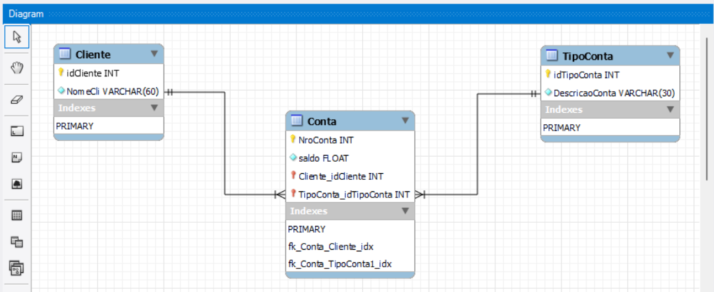

# 📘 Bloco 1 — Modelagem do Schema Financeiro: Diagrama ER e Forward Engineering

> **Duração estimada:** 35 minutos  
> **Objetivo:** Ler e interpretar o diagrama ER do schema `Financeiro`, identificar entidades e cardinalidades, e entender a sequência de `SET`s que o MySQL Workbench gera no início de todo script de **Forward Engineering**.  
> **Modalidade:** Guiada — você analisa o diagrama, executa os 3 `SET`s e prepara o ambiente.

---

## 🎯 O que você vai construir neste bloco

Ao final deste bloco, você terá:

- Compreendido o diagrama ER do schema `Financeiro`: três entidades (`Cliente`, `TipoConta`, `Conta`) e duas relações `1:N`.
- Identificado, no diagrama, qual coluna é **PK**, qual é **FK** e qual é **chave composta**.
- Executado a sequência de **três `SET`s** que abre todo script gerado pelo `Forward Engineering` do MySQL Workbench.
- Entendido **por que** cada um desses `SET`s existe e quando é boa prática mantê-los.

---

## 🗺️ Passo 1 — Leia o Diagrama ER

O diagrama abaixo descreve o schema `Financeiro`, exatamente como aparece no painel `Diagram` do MySQL Workbench.



```
   ┌──────────────────────┐                                       ┌──────────────────────┐
   │     Cliente          │                                       │     TipoConta        │
   ├──────────────────────┤                                       ├──────────────────────┤
   │ 🔑 idCliente : INT    │ 1                              1     │ 🔑 idTipoConta : INT  │
   │ ◇ NomeCli   : VC(60) │ ─────┐                       ┌────── │ ◇ DescricaoConta:VC(30)│
   └──────────────────────┘      │                       │       └──────────────────────┘
                                 │ N                   N │
                                 │                       │
                            ┌────▼───────────────────────▼────┐
                            │           Conta                 │
                            ├─────────────────────────────────┤
                            │ 🔑 NroConta             : INT    │
                            │ ◇ saldo                 : FLOAT │
                            │ 🔑🔗 Cliente_idCliente   : INT    │
                            │ 🔑🔗 TipoConta_idTipoConta:INT    │
                            └─────────────────────────────────┘
```

> 💡 **Legenda:** 🔑 = parte da chave primária | 🔗 = chave estrangeira | ◇ = atributo simples.

### 📋 As três entidades

| Entidade | Significado | PK |
|----------|-------------|-----|
| **`Cliente`** | Pessoa física dona de uma ou mais contas | `idCliente` (`AUTO_INCREMENT`) |
| **`TipoConta`** | Catálogo de tipos (Conta Corrente, Conta Poupança, etc.) | `idTipoConta` (`AUTO_INCREMENT`) |
| **`Conta`** | Conta bancária concreta — tem um número, um saldo, pertence a um cliente e é de um tipo | **PK composta**: (`NroConta`, `Cliente_idCliente`, `TipoConta_idTipoConta`) |

### 📋 As duas relações

| Relação | Cardinalidade | Significado |
|---------|---------------|-------------|
| `Cliente` → `Conta` | 1 : N | Um cliente pode ter várias contas; cada conta pertence a um único cliente |
| `TipoConta` → `Conta` | 1 : N | Um tipo de conta pode ser usado por várias contas; cada conta tem um único tipo |

> 🤔 **Por que a PK de `Conta` é composta** em vez de ser apenas `NroConta`? Porque o número da conta, isoladamente, não é único de forma absoluta no modelo proposto — a unicidade real é **o trio** "número, dono e tipo". (Um modelo alternativo seria fazer `NroConta` como PK simples e `Cliente_idCliente`/`TipoConta_idTipoConta` apenas como FKs — também é defensável. O diagrama do professor optou pela PK composta.)

---

## 💡 Antes de continuar — o que é "Forward Engineering"?

No MySQL Workbench, depois de você desenhar um diagrama ER no `Model Editor`, o item de menu **`Database → Forward Engineer`** gera **automaticamente** o script SQL que cria o schema, as tabelas, índices, FKs etc.

Esse script começa **sempre** com 3 `SET`s específicos. Como esses comandos costumam passar despercebidos pelo aluno (que tende a pular para o `CREATE TABLE`), vamos mostrá-los explicitamente e entender o que fazem.

---

## 🧭 Passo 2 — Execute os 3 `SET`s iniciais

```sql
SET @OLD_UNIQUE_CHECKS=@@UNIQUE_CHECKS, UNIQUE_CHECKS=0;
SET @OLD_FOREIGN_KEY_CHECKS=@@FOREIGN_KEY_CHECKS, FOREIGN_KEY_CHECKS=0;
SET @OLD_SQL_MODE=@@SQL_MODE, SQL_MODE='ONLY_FULL_GROUP_BY,STRICT_TRANS_TABLES,NO_ZERO_IN_DATE,NO_ZERO_DATE,ERROR_FOR_DIVISION_BY_ZERO,NO_ENGINE_SUBSTITUTION';
```

Cada `SET` faz **duas coisas em sequência**: (1) salva o valor atual da variável de sistema em uma variável de sessão prefixada com `@OLD_`, e (2) atribui um novo valor à variável de sistema. Vamos quebrar cada um.

### 🔹 `SET @OLD_UNIQUE_CHECKS=@@UNIQUE_CHECKS, UNIQUE_CHECKS=0;`

| Pedaço | O que significa |
|--------|-----------------|
| `@@UNIQUE_CHECKS` | A variável de sistema. Quando vale `1` (ligado), o MySQL **valida cada `INSERT/UPDATE`** contra constraints `UNIQUE` em tempo real. |
| `@OLD_UNIQUE_CHECKS = @@UNIQUE_CHECKS` | Guarda o valor original para poder restaurar ao final. |
| `UNIQUE_CHECKS = 0` | **Desliga** a checagem. Por quê? Porque durante a carga em massa de dados (muitos `INSERT`s seguidos), checar unicidade a cada linha é **lento**. Desligando e religando depois, ganha-se performance. |

> ⚠️ **Cuidado:** se houver duplicatas nos dados que você está inserindo, com `UNIQUE_CHECKS=0` elas podem **passar silenciosamente** durante a inserção. A integridade só é verificada quando o índice é "checado" novamente. Em scripts gerados pelo Workbench (que partem de uma base vazia), não há esse risco.

### 🔹 `SET @OLD_FOREIGN_KEY_CHECKS=@@FOREIGN_KEY_CHECKS, FOREIGN_KEY_CHECKS=0;`

| Pedaço | O que significa |
|--------|-----------------|
| `@@FOREIGN_KEY_CHECKS` | Quando vale `1`, o MySQL valida cada `INSERT/UPDATE/DELETE/CREATE TABLE` contra as constraints de FK. |
| `FOREIGN_KEY_CHECKS = 0` | **Desliga** a checagem temporariamente. |

**Por que isso é necessário?** Imagine que você precisa criar a tabela `Conta`, que tem FK para `Cliente`. Em ordem natural, você criaria `Cliente` primeiro e depois `Conta`. Mas e se as tabelas forem criadas em ordem alfabética ou em qualquer ordem aleatória? Com `FOREIGN_KEY_CHECKS=0`, o MySQL aceita criar `Conta` antes de `Cliente` sem reclamar — desde que, no final, todas as referências existam.

> 💡 **Útil também** em scripts de migração e restauração de backups, onde a ordem dos `INSERT`s pode quebrar momentaneamente as FKs.

### 🔹 `SET @OLD_SQL_MODE=@@SQL_MODE, SQL_MODE='ONLY_FULL_GROUP_BY,STRICT_TRANS_TABLES,NO_ZERO_IN_DATE,NO_ZERO_DATE,ERROR_FOR_DIVISION_BY_ZERO,NO_ENGINE_SUBSTITUTION';`

A `SQL_MODE` é a variável que define **quão estrito** o MySQL será na validação de SQL. O Workbench liga vários flags ao mesmo tempo:

| Flag | O que faz |
|------|-----------|
| `ONLY_FULL_GROUP_BY` | Rejeita `SELECT col, COUNT(*) FROM t GROUP BY x` quando `col` não está no `GROUP BY` nem em uma função de agregação. Padrão SQL clássico. |
| `STRICT_TRANS_TABLES` | Em tabelas transacionais (InnoDB), rejeita `INSERT/UPDATE` com valores inválidos (ex.: string em campo `INT`). Sem isso, o MySQL "trunca" silenciosamente. |
| `NO_ZERO_IN_DATE` | Rejeita datas com mês ou dia zerados (ex.: `'2025-00-15'`). |
| `NO_ZERO_DATE` | Rejeita a data `'0000-00-00'`. |
| `ERROR_FOR_DIVISION_BY_ZERO` | Em vez de retornar `NULL`, dispara erro ao dividir por zero. |
| `NO_ENGINE_SUBSTITUTION` | Se você pedir uma engine inexistente, o MySQL dispara erro em vez de cair em silêncio na engine padrão. |

> 💡 **Em conjunto, esses flags equivalem a "modo estrito" do MySQL** — comportamento mais próximo de outros SGBDs profissionais e mais seguro em produção.

---

## 🧭 Passo 3 — Verifique os valores ajustados

Após executar os 3 `SET`s, confira:

```sql
SELECT @@UNIQUE_CHECKS, @@FOREIGN_KEY_CHECKS, @@SQL_MODE;
```

Você deve ver:
* `@@UNIQUE_CHECKS = 0`
* `@@FOREIGN_KEY_CHECKS = 0`
* `@@SQL_MODE` contendo a lista de flags acima.

E confira também os valores **antigos** salvos:

```sql
SELECT @OLD_UNIQUE_CHECKS, @OLD_FOREIGN_KEY_CHECKS, @OLD_SQL_MODE;
```

> 💡 **Boa prática:** ao final de um script de Forward Engineering, há uma seção de "restauração" que faz `SET UNIQUE_CHECKS=@OLD_UNIQUE_CHECKS;` e companhia. Isso devolve a sessão ao estado original. Não vamos restaurar agora — vamos manter os flags relaxados durante toda a Aula ARQ13 (o que simplifica os blocos seguintes).

---

## ✏️ Atividade Prática

### 📝 Atividade 1 — Diagrama e Forward Engineering

Acesse a atividade completa em: [📁 Atividade/README.md](./Atividade/README.md)

**Resumo da atividade:**
- Reler o diagrama e responder perguntas sobre cardinalidade e PK composta.
- Refletir sobre quando faz sentido usar (e quando não usar) `FOREIGN_KEY_CHECKS=0`.
- Verificar que os flags de sessão foram aplicados corretamente.

---

## 📂 Código-fonte (gabarito)

> 🚨 **Use somente após sua tentativa.**

➡️ [codigo-fonte/COMANDOS-BD-03-bloco1.sql](./codigo-fonte/COMANDOS-BD-03-bloco1.sql)

---

## ✅ Resumo do Bloco 1

Neste bloco você:

- Leu o diagrama ER do schema `Financeiro` e identificou 3 entidades + 2 relações `1:N`.
- Reconheceu por que `Conta` tem **PK composta** com 3 colunas.
- Executou os 3 `SET`s do Forward Engineering e entendeu o efeito de cada um.
- Confirmou os ajustes via `@@variavel` e `@OLD_variavel`.

---

## 🎯 Conceitos-chave para fixar

💡 **Forward Engineering** é a geração automática de SQL a partir de um diagrama — todo script começa com `SET`s de configuração.

💡 **`UNIQUE_CHECKS=0`** acelera carga em massa, mas **assume** que os dados são limpos.

💡 **`FOREIGN_KEY_CHECKS=0`** permite criar tabelas em **qualquer ordem** sem violar FKs durante a criação.

💡 **`SQL_MODE` com flags estritos** é o **comportamento profissional** — recomendado em produção.

💡 **`@OLD_X = @@X`** é o padrão "save and restore" — guarda o valor original em variável de sessão para restaurar depois.

---

## ➡️ Próximos Passos

No Bloco 2 você vai criar o schema `Financeiro` e as duas tabelas "satélite" (`Cliente` e `TipoConta`), populá-las e confirmar com `COMMIT`.

Acesse: [📁 Bloco 2](../Bloco2/README.md)

---

> 💭 *"Antes de criar tabelas, configure a sessão. Antes de configurar a sessão, entenda os flags."*
